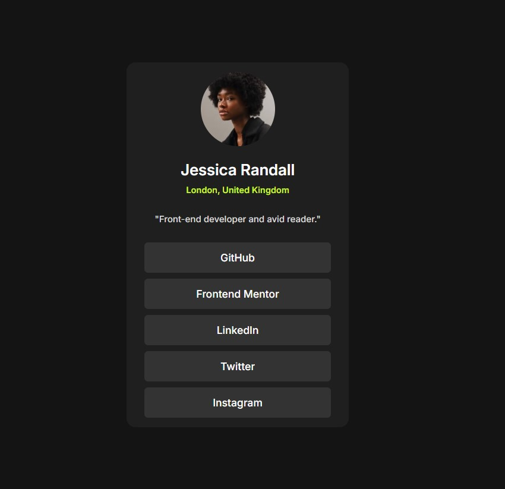

# Frontend Mentor - Blog preview card solution

This is my solution to the [Blog preview card challenge on Frontend Mentor](https://www.frontendmentor.io/challenges/blog-preview-card-ckPaj01Ma). Frontend Mentor challenges help improve your coding skills by building realistic projects.

## Overview

### The Challenge

Users should be able to:

- View the blog preview card layout
- See hover states for interactive elements

### Screenshot

### Links

- Solution URL: [GitHub Repo](https://github.com/icabduqaadir12/social-links-profile)
- Live Site URL: [Live Preview](https://icabduqaadir12.github.io/social-links-profile)

## My Process

### Built with

- Semantic HTML5
- CSS Custom Properties (Variables)
- Flexbox
- Mobile-first workflow
- Google Fonts (Figtree)

### What I learned

While building this project, I practiced:

- Structuring a clean and accessible HTML layout
- Using `rem` units for font sizes
- Customizing button hover effects with borders
- Creating consistent spacing with flexbox and padding
- Linking Google Fonts efficiently using `preconnect`

### Continued development

In future projects, I’d like to practice:

- BEM naming convention
- Responsive typography techniques
- Component-based CSS architecture

## Author

- GitHub – [@icabduqaadir12](https://github.com/icabduqaadir12)
- Frontend Mentor – [@icabduqaadir12](https://www.frontendmentor.io/profile/icabduqaadir12)

